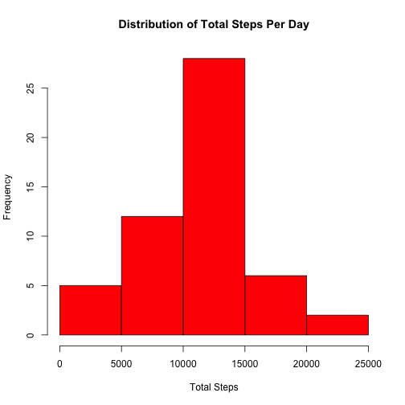

## Loading and preprocessing the data

```r
    activity <- read.csv('activity.csv')
    clean_steps <- activity[!is.na(activity$steps),]
```


## What is mean total number of steps taken per day?

```r
    activity <- read.csv('activity.csv')
    clean_steps <- activity[!is.na(activity$steps),]
    steps_per_day <- tapply(clean_steps$steps, factor(clean_steps$date), FUN=sum)
    hist(steps_per_day, xlab='Total Steps', main='Distribution of Total Steps Per Day', col='red')
```

 

```r
    mean(steps_per_day)
```

```
## [1] 10766.19
```

```r
    median(steps_per_day)
```

```
## [1] 10765
```


## What is the average daily activity pattern?


```r
    activity <- read.csv('activity.csv')
    clean_steps <- activity[!is.na(activity$steps),]
    steps_per_interval <- tapply(clean_steps$steps, factor(clean_steps$interval), FUN=mean)
    plot(levels(factor(clean_steps$interval)), 
         steps_per_interval, 
         type="l", 
         col="blue", 
         xlab="Minute Interval", 
         ylab="Avg. Steps", 
         main="Average Steps Taken Per 5 Minute Interval")
```

 

```r
    names(which.max(steps_per_interval))
```

```
## [1] "835"
```


## Imputing missing values


```r
    activity <- read.csv('activity.csv')
    sum(is.na(activity))
```

```
## [1] 2304
```

```r
    clean_steps <- activity[!is.na(activity$steps),]
    steps_per_interval <- tapply(clean_steps$steps, factor(clean_steps$interval), FUN=median)

    interpreted_activity <- activity

    median_steps <- sapply(activity[is.na(activity$steps), 
                           c("interval")], 
                           FUN=function(x) steps_per_interval[as.character(x)])
    interpreted_activity$steps[is.na(interpreted_activity$steps)] <- median_steps
            
    steps_per_day <- tapply(interpreted_activity$steps, factor(interpreted_activity$date), FUN=sum)

    hist(steps_per_day, xlab='Total Steps', main='Distribution of Total Steps Per Day', col='red')
```

 

```r
    mean(steps_per_day)
```

```
## [1] 9503.869
```

```r
    median(steps_per_day)
```

```
## [1] 10395
```

Yes. There is a difference in the mean and median steps per day when we impute missing data.
Imputing the median has lowered both the mean and median of the total number of a steps per day, since the median for most intervals was 0.

## Are there differences in activity patterns between weekdays and weekends?


```r
    library(lattice)
    activity <- read.csv('activity.csv')
    
    clean_steps <- activity[!is.na(activity$steps),]
    steps_per_interval <- tapply(clean_steps$steps, factor(clean_steps$interval), FUN=median)

    interpreted_activity <- activity
    median_steps <- sapply(activity[is.na(activity$steps), 
                           c("interval")], 
                           FUN=function(x) steps_per_interval[as.character(x)])
    interpreted_activity$steps[is.na(interpreted_activity$steps)] <- median_steps

    dayOfWeek <- sapply(activity$date, FUN=function(x) weekdays(strptime(x, '%Y-%m-%d'), abbreviate=TRUE))

    interpreted_activity$dayOfWeek <- sapply(dayOfWeek, 
                                             FUN=function(x) if(x %in% c('Sat', 'Sun')) "weekend" 
                                                             else "weekday")

    steps_avg <- as.data.frame(
                    as.table(
                        with(interpreted_activity, 
                             tapply(steps, 
                                    list(interval, dayOfWeek), 
                                    FUN=mean))))

    names(steps_avg) <- c('interval', 'dayOfWeek', 'steps')
    steps_avg$interval <- as.numeric(as.character(steps_avg$interval))

    xyplot(steps~interval | dayOfWeek, 
           data=steps_avg, 
           xlab="Interval", 
           ylab="Number of Steps", 
           xlim=seq(0,2400,5), 
           type="l", 
           layout=c(1,2))
```

 
